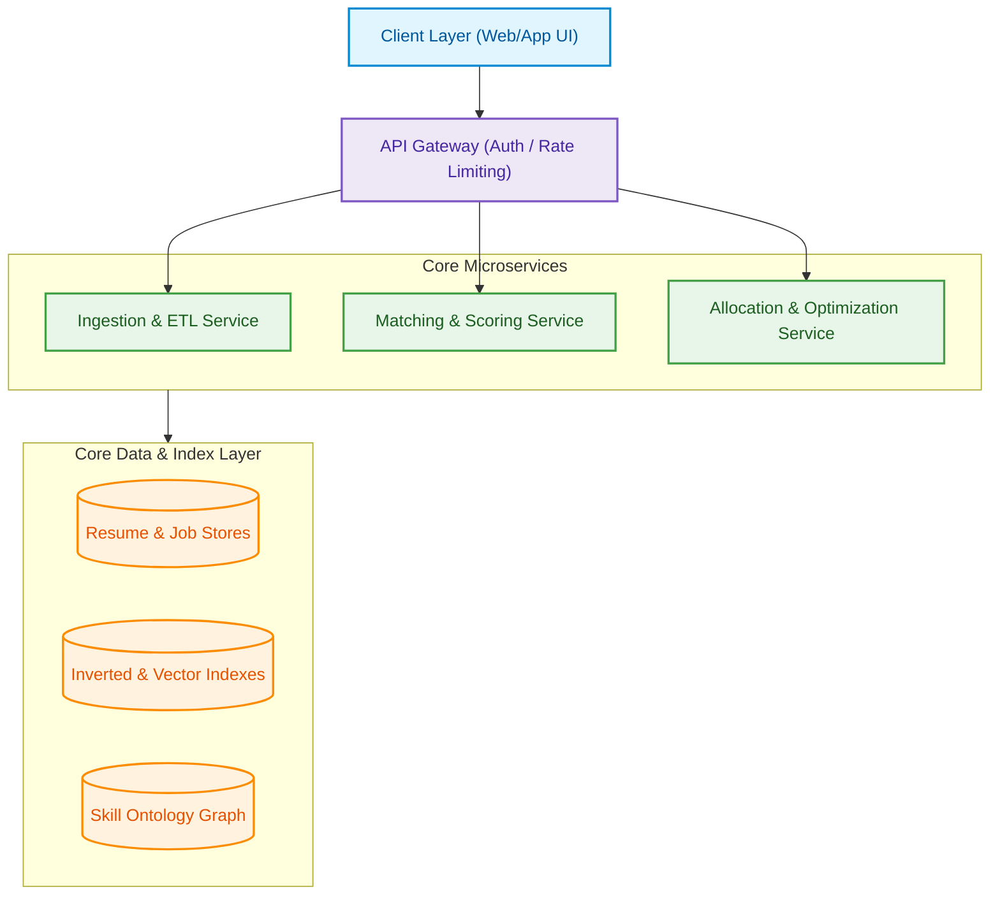

<div align="center">

# 🧭 Resume–Job Matching & Talent-Marketplace Engine

**A DSA-3 semester project that is also a real, production-shaped system design.**

Every core algorithm — search, fuzzy matching, scoring, optimal assignment, minimum-skill-set coverage —
is hand-built from first principles, no `java.util.*`-equivalent standard library shortcuts inside the engine.

[](#-status)
[-6f42c1)](#-dsa-3-module-mapping)
[](ABSTRACT/README.md)
[](#-documentation)
[](LICENSE)
[](ABSTRACT/README.md)

</div>

---

## 📌 What this is

A full engineering documentation package for a **resume ↔ job matching and talent-allocation platform**,
built as the semester project for **Data Structures and Algorithms – 3 (25CS2103E)** at KLBCH.

The system takes millions of resumes and job postings and answers three hard questions well:

| Question | How it's answered |
|---|---|
| 🔎 *Which candidates fit this job?* | Inverted-index retrieval + a calibrated, explainable fit-scoring model |
| 🧩 *How do we assign candidates to roles under real constraints?* | Bipartite matching / min-cost max-flow, with a stable-matching mode for two-sided marketplaces |
| 🧠 *What's the smallest set of hires that fully staffs a team?* | Classic NP-hard **set cover** — exact bitmask DP for small teams, greedy approximation at scale |

It is written to be picked up directly by a developer (or an AI coding agent) and implemented module-by-module — see [Phasing](docs/13-phasing-roadmap.md).

> 📄 Submitted for grading? Start with the official **[Project Abstract](ABSTRACT/README.md)** (team, roll numbers, guide, and the submitted abstract PDF).

---

## 👥 Team

| Name | Roll Number |
|---|---|
| Tejaswin Amara | 2520090104 |
| Sai Ram Pragnay Murikipudi | 2520090081 |

**Team 36 · Section 10** · Guide: Miss. Chandusha Kanda, Assistant Professor, CSIT · KL Deemed to be University, Hyderabad

---

## 📚 Documentation

| # | Section | What's inside |
|---|---|---|
| 1 | [System Overview](docs/01-system-overview.md) | Objectives, stakeholders, success metrics, architecture diagram |
| 2 | [Data Model & Normalization](docs/02-data-model-and-normalization.md) | Resume/job/skill schemas, alias resolution, ontology |
| 3 | [Matching & Scoring](docs/03-matching-and-scoring.md) | Fit-scoring model, synonym handling, fairness & bias |
| 4 | [Scheduling & Allocation](docs/04-scheduling-and-allocation.md) | Assignment problem, constraints, stability |
| 5 | [Minimum Skill Set](docs/05-minimum-skill-set.md) | Set-cover formulation, partial staffing |
| 6 | [Data Pipeline & Indexing](docs/06-data-pipeline-and-indexing.md) | Ingestion, dedup, real-time vs. batch, sharding |
| 7 | [API & Service Contracts](docs/07-api-and-service-contracts.md) | Endpoints, schemas, auth, observability |
| 8 | [Security, Privacy & Compliance](docs/08-security-privacy-compliance.md) | Retention, access control, consent, DSA-3 alignment |
| 9 | [Deployment Architecture](docs/09-deployment-architecture.md) | Tech stack, CI/CD, scaling plan |
| 10 | [Operational Considerations](docs/10-operational-considerations.md) | SLAs, test plans, migrations |
| 11 | [Schemas, Workflows & Pseudocode](docs/11-schemas-workflows-pseudocode.md) | Runnable pseudocode for every core algorithm |
| 12 | [Documentation Artifacts](docs/12-documentation-artifacts.md) | API reference, data dictionary, glossary |
| 13 | [Phasing: MVP → Enhancements](docs/13-phasing-roadmap.md) | Timeline, deliverables per phase |

> 📄 Prefer one long scroll? The entire package is also available as a single file: **[`FULL-DOCUMENTATION.md`](FULL-DOCUMENTATION.md)** *(auto-generated from `docs/` by [`scripts/build_full_documentation.py`](scripts/build_full_documentation.py) — always in sync, never hand-edited, enforced by CI)*

---

## 🏗️ Architecture at a Glance



Full diagram and module responsibilities → [`docs/01-system-overview.md`](docs/01-system-overview.md)

---

## 🎓 DSA-3 Module Mapping

Every algorithmic component traces back to a specific course module — this isn't decoration on top of a black box, the syllabus **is** the engine:

| Module | Course Topic | Where it lives in this system |
|---|---|---|
| **2** | String Algorithms | KMP, Z-function, Rabin-Karp, Aho-Corasick → skill/field extraction |
| **3** | Advanced DP | Wagner–Fischer edit distance → skill normalization · Bitmask DP → minimum skill set |
| **4** | Network Flow | Min-cost max-flow → candidate ↔ job allocation under team constraints |
| **5** | NP-Completeness & Approximation | Set cover + greedy approximation → minimum viable team skill set |
| **6** | Randomized & Parallel Algorithms | MinHash/LSH dedup · reservoir sampling · parallel prefix-sum |

Full alignment table → [`docs/08-security-privacy-compliance.md §8.5`](docs/08-security-privacy-compliance.md#85-dsa-3-syllabus-alignment-course-specific-note)

---

## 🧮 Core Algorithms (all hand-built, no stdlib collections)

<table>
<tr><th>Problem</th><th>Algorithm</th></tr>
<tr><td>Exact/fuzzy skill matching</td><td>Trie + Aho-Corasick, Wagner-Fischer edit distance</td></tr>
<tr><td>Semantic fallback matching</td><td>Cosine similarity over embeddings (ANN index)</td></tr>
<tr><td>Candidate retrieval at scale</td><td>Hand-built inverted index with skip pointers</td></tr>
<tr><td>Candidate → job assignment</td><td>Hungarian algorithm / Hopcroft–Karp / min-cost max-flow</td></tr>
<tr><td>Two-sided stable marketplace</td><td>Gale–Shapley deferred acceptance</td></tr>
<tr><td>Minimum team skill coverage</td><td>Bitmask DP (exact) · Greedy set cover (approximate, O(ln k))</td></tr>
<tr><td>Near-duplicate resume detection</td><td>Rolling-hash shingling + MinHash/LSH</td></tr>
</table>

Runnable pseudocode for every row above → [`docs/11-schemas-workflows-pseudocode.md`](docs/11-schemas-workflows-pseudocode.md)

---

## 🗺️ Status

| Phase | Focus | State |
|---|---|---|
| **Phase 0 — MVP** | Single-machine pipeline, core algorithms, course-demo scale | 📝 Documented, not yet built |
| **Phase 1 — Core Product** | Multi-role allocation, fairness/audit logging | ⏳ Planned |
| **Phase 2 — Scale & Hardening** | Millions-of-records, sharding, monitoring | ⏳ Planned |
| **Phase 3 — Continuous Enhancement** | Recalibration, A/B testing, parallel optimizations | ⏳ Ongoing (post-launch) |

Full timeline and per-phase deliverables → [`docs/13-phasing-roadmap.md`](docs/13-phasing-roadmap.md)

---

## 🚀 Getting Started (for implementers)

```bash
git clone https://github.com/sairampragney/DSA-3-PROJECT-.git
cd DSA-3-PROJECT-
```

1. Start with [`docs/01-system-overview.md`](docs/01-system-overview.md) and [`docs/02-data-model-and-normalization.md`](docs/02-data-model-and-normalization.md).
2. Build the Phase 0 MVP list in [`docs/13-phasing-roadmap.md`](docs/13-phasing-roadmap.md).
3. Use [`docs/11-schemas-workflows-pseudocode.md`](docs/11-schemas-workflows-pseudocode.md) as the direct spec for each hand-built algorithm — every function there is meant to be transcribed into working code, not paraphrased.
4. Every new/changed feature needs a known-answer unit test before merge — see [`docs/10-operational-considerations.md`](docs/10-operational-considerations.md).

---

## 🗂️ Repo Structure

```
DSA-3-PROJECT-/
├── README.md                             ← you are here
├── LICENSE                               ← academic-use license
├── FULL-DOCUMENTATION.md                 ← auto-generated, do not hand-edit
├── scripts/
│   └── build_full_documentation.py       ← regenerates FULL-DOCUMENTATION.md
├── .github/workflows/
│   └── docs-check.yml                    ← CI: sync check + link check
├── ABSTRACT/
│   ├── README.md                         ← team, roll numbers, guide, summary
│   └── DSA-3 Project Abstract.pdf        ← officially submitted abstract
└── docs/
    ├── 01-system-overview.md
    ├── 02-data-model-and-normalization.md
    ├── 03-matching-and-scoring.md
    ├── 04-scheduling-and-allocation.md
    ├── 05-minimum-skill-set.md
    ├── 06-data-pipeline-and-indexing.md
    ├── 07-api-and-service-contracts.md
    ├── 08-security-privacy-compliance.md
    ├── 09-deployment-architecture.md
    ├── 10-operational-considerations.md
    ├── 11-schemas-workflows-pseudocode.md
    ├── 12-documentation-artifacts.md
    └── 13-phasing-roadmap.md
```

---

<div align="center">

Built by **Tejaswin Amara** & **Sai Ram Pragnay Murikipudi** (Team 36) for **DSA-3 (25CS2103E)** · KLBCH · Odd Semester 2026-27

</div>
