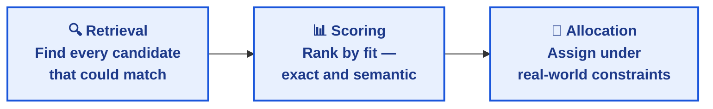
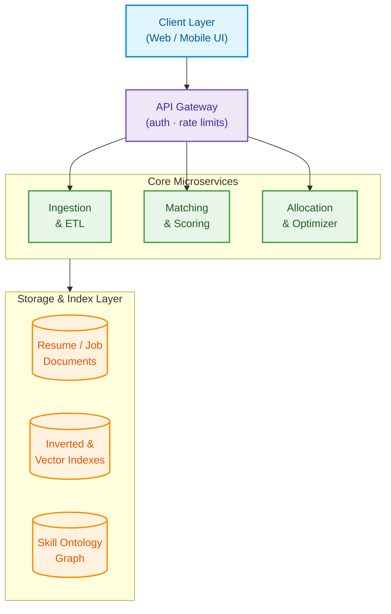

<div align="center">

# Resume–Job Matching & Talent-Marketplace Engine

### A modern recruitment system built the hard way — every algorithm from first principles (Python 3.12+).

Search, fuzzy matching, fit scoring, optimal assignment, NP-hard set cover — no library shortcuts, no black boxes. Written as the **DSA-3** semester project, engineered like production software.

[](docs/01-system-overview.md)
[](docs/01-system-overview.md)
[](ABSTRACT/README.md)
[](docs/01-system-overview.md)
[](LICENSE)

[Read the docs](docs/01-system-overview.md) · [See the algorithms](#core-algorithms) · [Start building](#getting-started)

</div>

<br>

## Contents

- [The problem](#the-problem)
- [How it works](#how-it-works)
- [Documentation](#documentation)
- [System architecture](#system-architecture)
- [Core algorithms](#core-algorithms)
- [DSA-3 syllabus mapping](#dsa-3-syllabus-mapping)
- [Status & timeline](#status--timeline)
- [Getting started](#getting-started)
- [Repository structure](#repository-structure)
- [Team](#team)

<br>

## The problem

Recruitment breaks at scale. A company with thousands of open roles and millions of candidate profiles needs to answer three hard questions, fast and fairly:

| | Question | Why it's hard |
|---|---|---|
| **Search** | Which candidates actually fit this job? | Free-text resumes, inconsistent skill naming, millions of records |
| **Match** | How do we assign candidates to roles under real constraints? | Budget limits, geography, one candidate can only take one job |
| **Staff** | What's the smallest hiring set that covers every required skill? | Classic NP-hard set cover — no shortcuts exist at scale |

This engine answers all three with algorithms built from first principles — inverted-index retrieval, min-cost max-flow, bitmask dynamic programming — documented well enough to implement without guesswork.

<br>

## How it works

The system runs in three stages: **find**, **rank**, **assign**.



**1 · Retrieval** — Build an inverted index over candidate skills and attributes. Aho-Corasick handles multi-pattern skill matching in one pass. Returns a ranked candidate pool in milliseconds, even across millions of resumes.

**2 · Scoring** — Fuzzy matching (edit distance, prefix matching) catches typos and abbreviations. When exact matching fails, a semantic fallback over vector embeddings picks up the rest. Every score is a weighted, explainable sum — never a black box.

**3 · Allocation** — One-to-one matches use the Hungarian algorithm or Hopcroft–Karp. Many-to-many constraints route through a min-cost max-flow network. Two-sided marketplaces — where candidates *and* employers have preferences — use Gale–Shapley deferred acceptance for a stable outcome.

**Team staffing (bonus).** Given a required skill set, find the minimum team that covers it: exact bitmask DP for small teams, greedy set-cover approximation (O(ln k) bound) for large hiring sprees.

**Before any of this** — resumes and job posts are normalized into structured skill profiles. "JS", "JavaScript", and "javascript.ts" resolve to one node in a skill ontology graph. "Python 3.x" resolves to "Python". Full schema in [`docs/02-data-model-and-normalization.md`](docs/02-data-model-and-normalization.md).

<br>

## Documentation

Thirteen sections, each with pseudocode, workflows, and the reasoning behind every decision.

<table>
<tr><td width="50%" valign="top">

**Foundations**
1. [System Overview](docs/01-system-overview.md)
2. [Data Model & Normalization](docs/02-data-model-and-normalization.md)

**Core algorithms**

3. [Matching & Scoring](docs/03-matching-and-scoring.md)
4. [Scheduling & Allocation](docs/04-scheduling-and-allocation.md)
5. [Minimum Skill Set](docs/05-minimum-skill-set.md)

</td><td width="50%" valign="top">

**Building & operating**

6. [Data Pipeline & Indexing](docs/06-data-pipeline-and-indexing.md)
7. [API & Service Contracts](docs/07-api-and-service-contracts.md)
8. [Security, Privacy & Compliance](docs/08-security-privacy-compliance.md)
9. [Deployment Architecture](docs/09-deployment-architecture.md)
10. [Operational Considerations](docs/10-operational-considerations.md)

**Reference**

11. [Schemas, Workflows & Pseudocode](docs/11-schemas-workflows-pseudocode.md) — start here to code
12. [Documentation Artifacts](docs/12-documentation-artifacts.md)
13. [Phasing: MVP → Enhancements](docs/13-phasing-roadmap.md)

</td></tr>
</table>

Prefer one file? [`FULL-DOCUMENTATION.md`](FULL-DOCUMENTATION.md) concatenates all thirteen — auto-generated, kept in sync by CI, never hand-edited.

<br>

## System architecture

Three independent services behind a gateway, one shared data layer, horizontal scaling on every tier.



Full diagram and per-module responsibilities → [`docs/01-system-overview.md`](docs/01-system-overview.md)

<br>

## Core algorithms

Nothing here comes off the shelf. No `java.util.*` collections, no matching libraries — every routine is implemented from scratch and paired with runnable pseudocode.

| Problem | Algorithm | Docs |
|---|---|---|
| Exact / fuzzy skill matching | Trie + Aho-Corasick, Wagner–Fischer edit distance | [03](docs/03-matching-and-scoring.md) |
| Semantic fallback matching | Cosine similarity over embeddings, ANN index | [03](docs/03-matching-and-scoring.md) |
| Candidate retrieval at scale | Hand-built inverted index with skip pointers | [06](docs/06-data-pipeline-and-indexing.md) |
| Candidate ↔ job assignment | Hungarian · Hopcroft–Karp · min-cost max-flow | [04](docs/04-scheduling-and-allocation.md) |
| Two-sided stable marketplace | Gale–Shapley deferred acceptance | [04](docs/04-scheduling-and-allocation.md) |
| Minimum team skill coverage | Bitmask DP (exact) · greedy set cover, O(ln k) | [05](docs/05-minimum-skill-set.md) |
| Near-duplicate resume detection | Rolling-hash shingling + MinHash/LSH | [06](docs/06-data-pipeline-and-indexing.md) |

Every row has runnable pseudocode in [`docs/11-schemas-workflows-pseudocode.md`](docs/11-schemas-workflows-pseudocode.md) — meant to be transcribed, not paraphrased.

<br>

## DSA-3 syllabus mapping

This isn't a system with algorithms bolted on for a grade — the syllabus **is** the architecture.

| Module | Course topic | Where it lives |
|:---:|---|---|
| 2 | String Algorithms | KMP, Z-function, Rabin-Karp, Aho-Corasick → skill extraction |
| 3 | Advanced DP | Wagner–Fischer edit distance → skill normalization · Bitmask DP → minimum skill set |
| 4 | Network Flow | Min-cost max-flow → candidate ↔ job allocation under constraints |
| 5 | NP-Completeness & Approximation | Set cover + greedy approximation → minimum viable hiring team |
| 6 | Randomized & Parallel Algorithms | MinHash/LSH dedup · reservoir sampling · parallel prefix-sum |

Full alignment notes → [`docs/08-security-privacy-compliance.md §8.5`](docs/08-security-privacy-compliance.md)

<br>

## Status & timeline

| Phase | Focus | State |
|---|---|:---:|
| **0 — MVP** | Single-machine pipeline, core algorithms, course-demo scale | 📝 Documented |
| **1 — Core Product** | Multi-role allocation, fairness & audit logging | ⏳ Planned |
| **2 — Scale & Hardening** | Millions of records, sharding, monitoring | ⏳ Planned |
| **3 — Continuous Enhancement** | Recalibration, A/B testing, parallel optimization | ⏳ Post-launch |

Full timeline and deliverables per phase → [`docs/13-phasing-roadmap.md`](docs/13-phasing-roadmap.md)

<br>

## Getting started

```bash
git clone https://github.com/tejaswin-amara/Resume_Job_Matching_Talent_Marketplace_Engine.git
cd Resume_Job_Matching_Talent_Marketplace_Engine
```

**To understand the system** — read [`01-system-overview.md`](docs/01-system-overview.md), then skim [03](docs/03-matching-and-scoring.md), [04](docs/04-scheduling-and-allocation.md), and [05](docs/05-minimum-skill-set.md) for the three core algorithms.

**To implement it:**
1. Read [`01-system-overview.md`](docs/01-system-overview.md) and [`02-data-model-and-normalization.md`](docs/02-data-model-and-normalization.md) for the foundations.
2. Check what's actually in scope for Phase 0 in [`13-phasing-roadmap.md`](docs/13-phasing-roadmap.md).
3. Build straight from [`11-schemas-workflows-pseudocode.md`](docs/11-schemas-workflows-pseudocode.md) — every function is written to be transcribed, not reinterpreted.
4. Ship nothing without a known-answer unit test. Testing strategy in [`10-operational-considerations.md`](docs/10-operational-considerations.md).

<br>

## Repository structure

```
Resume_Job_Matching_Talent_Marketplace_Engine/
├── README.md                        you are here
├── LICENSE                          academic-use license
├── FULL-DOCUMENTATION.md            auto-generated, do not hand-edit
│
├── ABSTRACT/
│   ├── README.md                    team, roll numbers, guide, summary
│   └── DSA-3 Project Abstract.pdf   officially submitted abstract
│
├── docs/
│   ├── 01-system-overview.md
│   ├── 02-data-model-and-normalization.md
│   ├── 03-matching-and-scoring.md
│   ├── 04-scheduling-and-allocation.md
│   ├── 05-minimum-skill-set.md
│   ├── 06-data-pipeline-and-indexing.md
│   ├── 07-api-and-service-contracts.md
│   ├── 08-security-privacy-compliance.md
│   ├── 09-deployment-architecture.md
│   ├── 10-operational-considerations.md
│   ├── 11-schemas-workflows-pseudocode.md
│   ├── 12-documentation-artifacts.md
│   └── 13-phasing-roadmap.md
│
├── backend/                         Spring Boot services
│   ├── src/
│   ├── pom.xml
│   └── Dockerfile
│
├── frontend/                        Next.js client
│   ├── app/
│   ├── package.json
│   └── Dockerfile
│
├── engine/                          Python matching & optimization
│   ├── algorithms/
│   ├── main.py
│   ├── requirements.txt
│   └── Dockerfile
│
├── scripts/
│   └── build_full_documentation.py  regenerates FULL-DOCUMENTATION.md
│
├── docker-compose.yml                local dev stack
├── commitlint.config.js
└── .github/workflows/                CI: docs sync + link check
```

<br>

## Team

| Name | Roll Number |
|---|---|
| Tejaswin Amara | 2520090104 |
| Sai Ram Pragnay Murikipudi | 2520090081 |

**Team 36 · Section 10**  
Guide: Miss. Chandusha Kanda, Assistant Professor, CSIT  
KL Deemed to be University, Hyderabad · Odd Semester 2026–27

Full submission details → [`ABSTRACT/README.md`](ABSTRACT/README.md)

---

<div align="center">

Built by **Tejaswin Amara** & **Sai Ram Pragnay Murikipudi** for **DSA-3 (25CS2103E)** · KLBCH

</div>
