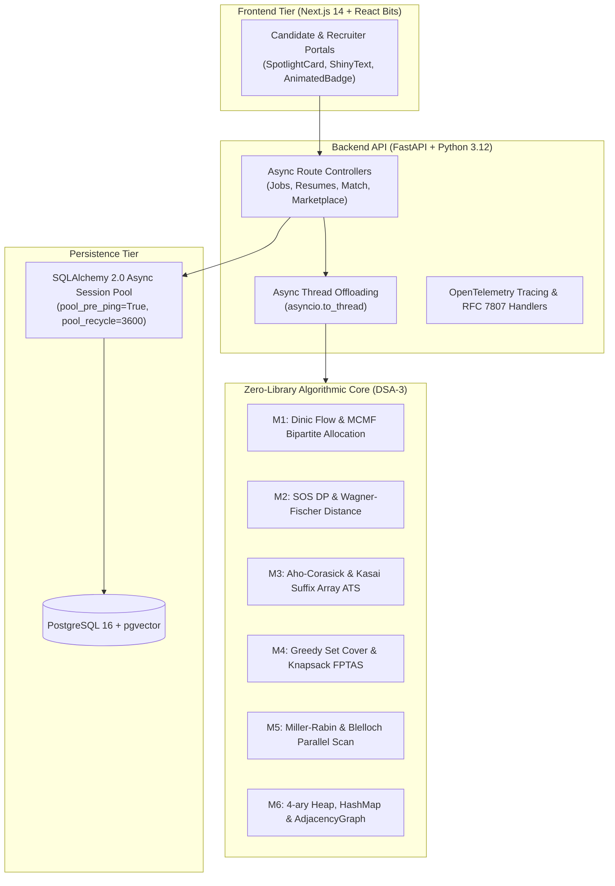

# Talent Marketplace & Resume Matching Engine

[](https://github.com/tejaswin-amara/Resume_Job_Matching_Talent_Marketplace_Engine/actions)
[](tests/)
[](web/tests/)
[](pyproject.toml)
[](web/)
[](https://reactbits.dev/)
[](LICENSE)

A high-throughput, enterprise-grade talent marketplace and automated candidate matching engine. Combines a zero-external-dependency algorithmic core (**DSA-3 Modules M1–M6**) with hybrid semantic vector search, PostgreSQL/pgvector persistence, and an interactive Next.js 14 frontend powered exclusively by [React Bits](https://reactbits.dev/).

---

## 🏛️ System Architecture


```mermaid
flowchart TD
    subgraph Frontend["Frontend Tier (Next.js 14 + React Bits)"]
        UI["Candidate & Recruiter Portals<br/>(SpotlightCard, ShinyText, AnimatedBadge)"]
    end

    subgraph API["Backend API (FastAPI + Python 3.12)"]
        ROUTERS["Async Route Controllers<br/>(Jobs, Resumes, Match, Marketplace)"]
        TO_THREAD["Async Thread Offloading<br/>(asyncio.to_thread)"]
        TELEMETRY["OpenTelemetry Tracing & RFC 7807 Handlers"]
    end

    subgraph Domain["Zero-Library Algorithmic Core (DSA-3)"]
        M1["M1: Dinic Flow & MCMF Bipartite Allocation"]
        M2["M2: SOS DP & Wagner-Fischer Distance"]
        M3["M3: Aho-Corasick & Kasai Suffix Array ATS"]
        M4["M4: Greedy Set Cover & Knapsack FPTAS"]
        M5["M5: Miller-Rabin & Blelloch Parallel Scan"]
        M6["M6: 4-ary Heap, HashMap & AdjacencyGraph"]
    end

    subgraph Storage["Persistence Tier"]
        DB[(PostgreSQL 16 + pgvector)]
        SESSIONS["SQLAlchemy 2.0 Async Session Pool<br/>(pool_pre_ping=True, pool_recycle=3600)"]
    end

    UI --> ROUTERS
    ROUTERS --> TO_THREAD
    TO_THREAD --> Domain
    ROUTERS --> SESSIONS
    SESSIONS --> DB
```

---

## 🎯 Hybrid ATS Matching Formula

Candidates are evaluated across four weighted dimensions using normalized scoring:

$$
\text{Score} = 100 \times \left(0.40 \cdot S_{\text{semantic}} + 0.35 \cdot S_{\text{skill}} + 0.15 \cdot S_{\text{experience}} + 0.10 \cdot S_{\text{education}}\right)
$$

- **$S_{\text{semantic}}$**: Cosine similarity between `all-MiniLM-L6-v2` 384-dimensional dense embeddings stored in PostgreSQL `pgvector`.
- **$S_{\text{skill}}$**: Exact multi-keyword matching via Aho-Corasick combined with Wagner-Fischer fuzzy tolerance ($\le 2$ edit distance).
- **$S_{\text{experience}}$**: Non-linear experience penalty/bonus capped at job requirement bounds.
- **$S_{\text{education}}$**: Ordinal qualification level mapping (PhD > Master's > Bachelor's > Associate's).

---

## 🚀 Quick Start

### 1. Run with Docker Compose (Recommended)

```bash
docker compose up --build -d
```

- **Frontend Application:** `http://localhost:3000`
- **FastAPI Documentation:** `http://localhost:8000/docs`
- **Health Live Probe:** `http://localhost:8000/health/live`
- **Health Ready Probe:** `http://localhost:8000/health/ready`

The Compose web service sets `BACKEND_URL=http://backend:8000`. Next.js rewrites
`/api/:path*` to `${BACKEND_URL}/api/:path*`, so `/api/v1/*` requests reach FastAPI.

### 2. Local Development Setup

#### Backend (Python 3.12 + UV)
```bash
# Install uv and sync dependencies
uv sync

# Run database migrations
uv run alembic upgrade head

# Start FastAPI development server
uv run uvicorn api.app:create_app --factory --reload --port 8000
```

#### Frontend (Next.js 14 + pnpm)
```bash
cd web
pnpm install
pnpm dev
```

---

## 📡 API Specification & Endpoints

| Method | Endpoint | Description | Response Model |
|---|---|---|---|
| `GET` | `/health/live` | Liveness probe for orchestrators/K8s | `HealthResponse` (200) |
| `GET` | `/health/ready` | Readiness probe verifying PostgreSQL connection | `HealthResponse` (200 / 503) |
| `POST` | `/api/v1/jobs` | Create a job requisition with skill requirements | `JobResponse` (200) |
| `GET` | `/api/v1/jobs` | Paginated listing of open job requisitions | `list[JobResponse]` (200) |
| `GET` | `/api/v1/jobs/{id}/matches` | View candidate leaderboards for a job | `list[MatchResultResponse]` (200) |
| `POST` | `/api/v1/resumes/upload` | Upload & parse resume file (PDF, DOCX, TXT) | `CandidateResponse` (200) |
| `POST` | `/api/v1/resumes/parse-text` | Parse raw unstructured resume text | `CandidateResponse` (200) |
| `POST` | `/api/v1/match/adhoc` | Run ad-hoc 4-signal hybrid ATS match | `MatchResultResponse` (200) |
| `POST` | `/api/v1/marketplace/allocate` | Run Dinic's capacity-constrained allocation | `MarketplaceAllocation` (200) |
| `GET` | `/api/v1/marketplace/bottlenecks` | Identify candidate/job bottleneck cuts | `BottleneckResponse` (200) |
| `POST` | `/api/v1/marketplace/team-builder`| Greedy set-cover minimum cost team | `TeamBuilderResponse` (200) |

---

## 🧪 Comprehensive Verification Matrix

The codebase is protected by automated quality gates:

```bash
# 1. Linting & Formatting (0 errors)
uv run ruff check .

# 2. Frontend Vitest Unit Suite (9/9 passed)
pnpm --dir web test

# 3. Next.js Production Build (14/14 static pages generated)
pnpm --dir web build

# 4. Backend & Algorithmic Test Suite (245/245 passed)
uv run pytest tests/unit/ tests/contract/ tests/e2e/ tests/benchmarks/ tests/stress/ -q

# 5. Playwright End-to-End Suite
pnpm --dir web exec playwright test
```

---

## 📂 Repository Layout

```
├── api/                  # FastAPI Application & Asynchronous Controllers
│   ├── controllers/      # Health, Jobs, Resumes, Match, Marketplace
│   ├── telemetry/        # OpenTelemetry Instrumentation & Tracing
│   ├── errors.py         # RFC 7807 Problem Detail Handlers
│   └── schemas/          # Pydantic v2 Contract Specifications
├── core/
│   ├── engine/           # Zero-Library DSA-3 Algorithmic Core (M1–M6)
│   ├── parsers/          # Magic-Byte PDF, DOCX, Text Document Parsers
│   └── scoring/          # Hybrid ATS Scoring Engine & Skill Extractor
├── db/                   # PostgreSQL 16 Models, Pgvector, Session Pooling
├── migrations/           # Alembic Asynchronous Migration Scripts
├── web/                  # Next.js 14 App Router Frontend
│   ├── src/app/          # Candidate Portal, Recruiter Portal, Market Allocation
│   ├── src/components/   # React Bits UI Components (SpotlightCard, ShinyText, etc.)
│   └── tests/            # Vitest Component Tests & Playwright E2E
├── tests/                # 245+ Pytest Test Suites
│   ├── benchmarks/       # Empirical Big-O Complexity Validation
│   ├── contract/         # Schemathesis OpenAPI 3.1 Contract Fuzzing
│   ├── e2e/              # Multi-tier End-to-End User Scenarios
│   ├── integration/      # Testcontainers PostgreSQL/Pgvector Integration
│   ├── stress/           # Heavy Concurrency & Algorithmic Oracle Tests
│   └── unit/             # Isolated Module Unit Tests
├── .github/workflows/    # CI/CD (UV, Ruff, Gitleaks, Semgrep, Trivy, Vitest, Pytest)
├── docker-compose.yml    # Multi-Container Deployment Profile
└── pyproject.toml        # Python Packaging & Dependency Manifest
```

---

## 📄 License

This project is licensed under the [MIT License](LICENSE).
