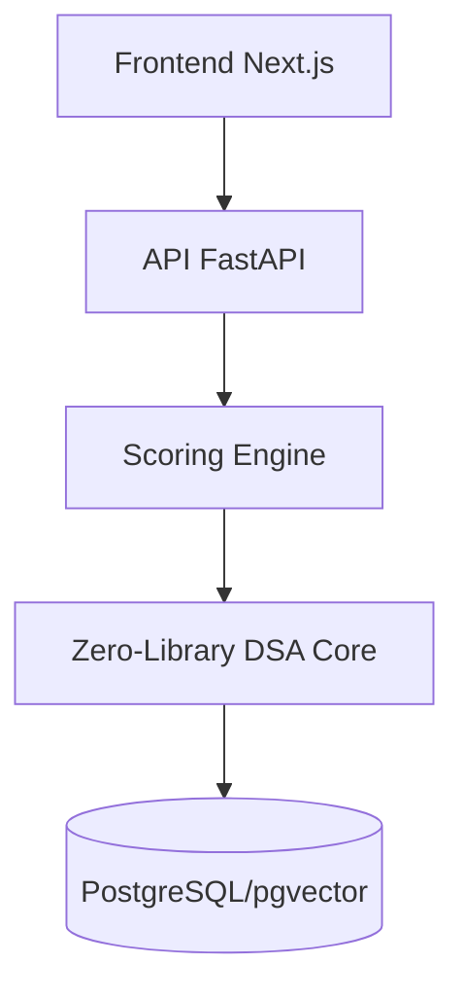

# Talent Marketplace Engine


A high-performance, zero-library algorithmic core for candidate-job matching and talent marketplace mechanics. Built from the ground up without using external standard libraries for core DSA.

## Architecture Overview


```mermaid
flowchart TD
    A[Frontend Next.js] --> B[API FastAPI]
    B --> C[Scoring Engine]
    C --> D[Zero-Library DSA Core]
    D --> E[(PostgreSQL/pgvector)]
```

## Zero-Library DSA Core Modules

| Module | Subsystem | Algorithms Used |
|---|---|---|
| **M1: Flow** | Marketplace Network | Dinic's Algorithm, Edmonds-Karp, Min-Cost Max-Flow |
| **M2: DP** | Talent Skill Matching | SOS DP (Yates' Technique), Wagner-Fischer |
| **M3: String** | Resume Parsing / ATS | Aho-Corasick, KMP, Rabin-Karp, Suffix Array, Z-Algo |
| **M4: Approx** | Team Formation | Greedy Set Cover, Knapsack FPTAS, Vertex Cover |
| **M5: Randomised**| Load Balancing | Miller-Rabin, Reservoir Sampling |
| **M6: Structures**| Core Primitives | Custom Graph, Priority Queue, Hash Map, ArrayList |

## ATS Scoring Formula

The hybrid matching system evaluates candidates across four dimensions using the following weighted formula:

$$
S = 100 \times \left(0.40 \cdot S_{semantic} + 0.35 \cdot S_{skill} + 0.15 \cdot S_{experience} + 0.10 \cdot S_{education}\right)
$$

## Quick Start

Run the entire application stack (API, DB, Frontend) using Docker Compose:

```bash
docker compose up -d
```

## API Endpoints

| Endpoint | Method | Description |
|---|---|---|
| `/health` | GET | Health check status |
| `/api/jobs` | POST | Create a new job requirement |
| `/api/resumes` | POST | Upload and parse a candidate resume |
| `/api/match` | GET | Run hybrid ATS match |
| `/api/marketplace` | GET | View talent network allocations |

## Development Setup

```bash
# Sync dependencies
uv sync

# Run tests
python -m pytest tests/unit/ tests/stress/ tests/benchmarks/ -q

# Format code
ruff check .
```

## Project Structure

```
├── api/                  # FastAPI Application
├── core/
│   ├── engine/           # Zero-library DSA M1-M6 Algorithms
│   ├── parsers/          # Custom PDF, DOCX, Text parsers
│   └── scoring/          # ATS Hybrid Matcher & Extractors
├── db/                   # SQLAlchemy Models & Alembic Migrations
├── tests/
│   ├── benchmarks/       # Empirical Big-O Scaling Tests
│   ├── stress/           # Stress Tests
│   └── unit/             # Unit Tests
└── docker-compose.yml
```

## License

MIT License
