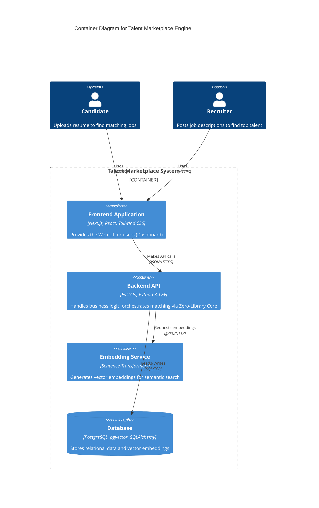

# Container Architecture

This document describes the high-level container architecture of the system.

## C4 Container Diagram

```mermaid
C4Container
    title Container Diagram for Talent Marketplace Engine

    Person(candidate, "Candidate", "Uploads resume to find matching jobs")
    Person(recruiter, "Recruiter", "Posts job descriptions to find top talent")

    Container_Boundary(system, "Talent Marketplace System") {
        Container(frontend, "Frontend Application", "Next.js, React, Tailwind CSS", "Provides the Web UI for users (Dashboard)")
        Container(backend, "Backend API", "FastAPI, Python 3.12+", "Handles business logic, orchestrates matching via Zero-Library Core")
        Container(embedding, "Embedding Service", "Sentence-Transformers", "Generates vector embeddings for semantic search")
        ContainerDb(db, "Database", "PostgreSQL, pgvector, SQLAlchemy", "Stores relational data and vector embeddings")
    }

    Rel(candidate, frontend, "Uses", "HTTPS")
    Rel(recruiter, frontend, "Uses", "HTTPS")

    Rel(frontend, backend, "Makes API calls", "JSON/HTTPS")
    Rel(backend, db, "Reads/Writes", "SQL/TCP")
    Rel(backend, embedding, "Requests embeddings", "gRPC/HTTP")
```
