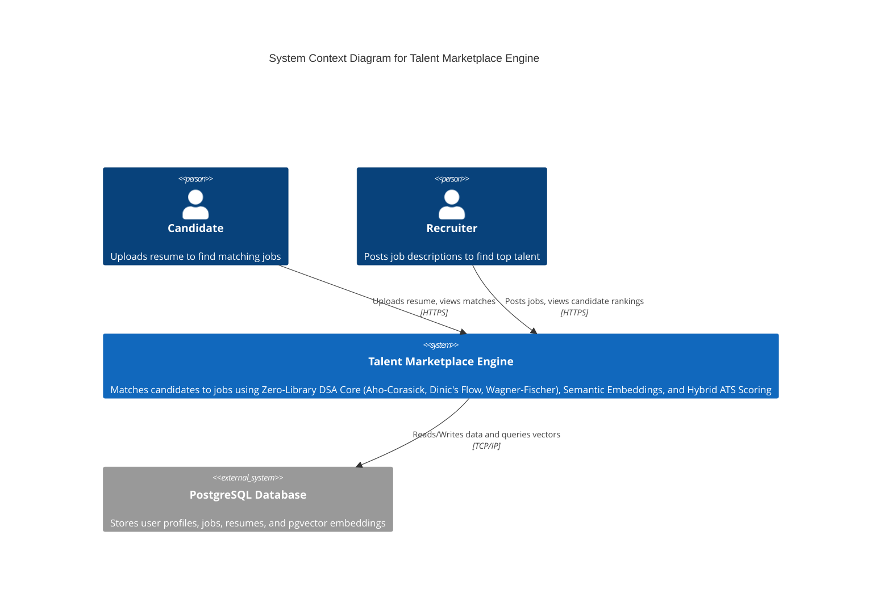

# System Context

This document outlines the System Context for the Resume & Job Matching Talent Marketplace Engine.

## C4 System Context Diagram

## Description
The core system relies on a bespoke algorithmic engine that computes skill taxonomies and semantic relevance score, assigning optimal candidates via network flow algorithms.
