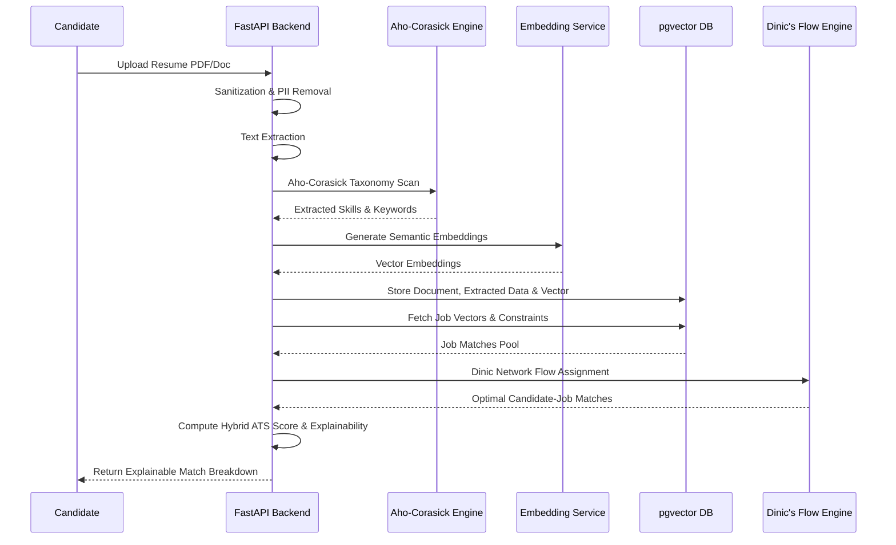

# End-to-End Data Flow

This document details the data flow for the resume upload and matching process.

## Resume Processing and Matching Flow

```mermaid
sequenceDiagram
    participant C as Candidate
    participant API as FastAPI Backend
    participant AC as Aho-Corasick Engine
    participant EMB as Embedding Service
    participant DB as pgvector DB
    participant DF as Dinic's Flow Engine

    C->>API: Upload Resume PDF/Doc
    API->>API: Sanitization & PII Removal
    API->>API: Text Extraction
    API->>AC: Aho-Corasick Taxonomy Scan
    AC-->>API: Extracted Skills & Keywords
    API->>EMB: Generate Semantic Embeddings
    EMB-->>API: Vector Embeddings
    API->>DB: Store Document, Extracted Data & Vector
    API->>DB: Fetch Job Vectors & Constraints
    DB-->>API: Job Matches Pool
    API->>DF: Dinic Network Flow Assignment
    DF-->>API: Optimal Candidate-Job Matches
    API->>API: Compute Hybrid ATS Score & Explainability
    API-->>C: Return Explainable Match Breakdown
```
